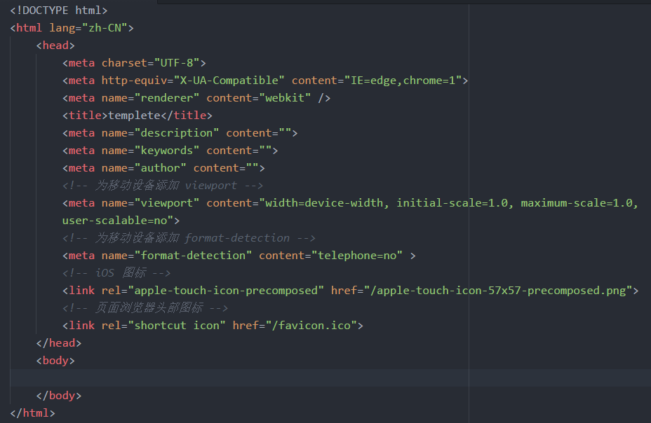

# html-css
Review notes about html/css

<h1><一>----------About html structure analysis:</h1>
<h2> 页面三要素：标题(title)、关键词(meta)、描述(meta) </h2>

  <h2>1. html document creation</h2>  
    
 1.文档类型声明：<!DOCTYPE html>这是HTML5标准的文档类型声明；   
	作用：告诉浏览器两件事---------  
	---1.本文档处理的是html文档；     
	---2.用来标记文档内容的html所属版本。

    

    
 2.html元素（根元素，此处表示文档html部分的开始）   
	该元素包含两个子元素 head body。  

    
	3.head元素（此处包含文档的元数据）
	 元数据向浏览器提供了有关文档内容  

  <h2>2. html template</h2>
  
  
  
  <h2>3. Document type</h2>
	<h3><!DOCTYPE>声明帮助浏览器正确地显示网页。</h3>
	   
不是html标签，它为浏览器提供一项信息声明，即html是用什么版本编写的。

	
	HTML5:
		<!DOCTYPE html>
	HTML 4.01 Strict(该DTD包含所有html元素和属性,但 不包括展示性的和弃用的元素,不允许框架集):
		<!DOCTYPE HTML PUBLIC "-//W3C//DTD HTML 4.01//EN" "http://www.w3.org/TR/html4/strict.dtd"
		
	HTML 4.01 Transitional(该DTD包含所有html元素和属性,包括展示性的和弃用的元素,不允许框架集):
		<!DOCTYPE HTML PUBLIC "-//W3C//DTD HTML 4.01 Transitional//EN" "http://www.w3.org/TR/html4/loose.dtd"
		
	HTML 4.01 Frameset(该DTD等同于HTML 4.01 Transitional,但允许框架集内容):
		<!DOCTYPE HTML PUBLIC "-//W3C//DTD HTML 4.01 Frameset//EN" "http://www.w3.org/TR/html4/frameset.dtd">
		
	XHTML 1.0 Strict(该DTD包含所有HTML元素和属性,但不包括展示性和弃用的元素,不允许框架集,必须以格式正确的XML来编写标记):
		<!DOCTYPE html PUBLIC "-//W3C//DTD XHTML 1.0 Strict//EN" "http://www.w3.org/TR/xhtml1/DTD/xhtml1-strict.dtd"> 

  <h2>4. Metadata analysis</h2>
    
1. charset="UTF-8"  表示字符编码的meta一定要放在第一个

	  
2. name="renderder" content="webkit"  指定双核浏览器默认以何种方式渲染页面  

	  
3. name="viewport" content="width=device-width, initial-scale=1.0"  

	  
      浏览器窗口内容区大小         浏览器窗口内容区大小     初始缩放比例    

    
4. http-equiv="X-UA-Compatible" content="ie=edge,chrome=1"   表示在IE8优先使用最新版的IE和Chrome  

    
5. name="format-detection" content="telephone=no"   取消移动电话标识   

    <h3> SEO优化 </h3>
    
 name="keywords" content="关键字   关键字" 

    
 name="description" content="描述   描述" 

    
 name="author" content="作者信息" 

  
  
