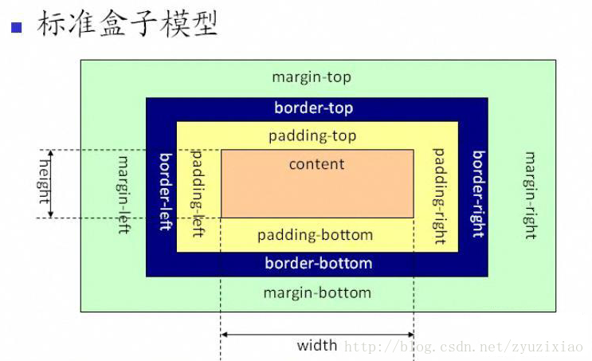
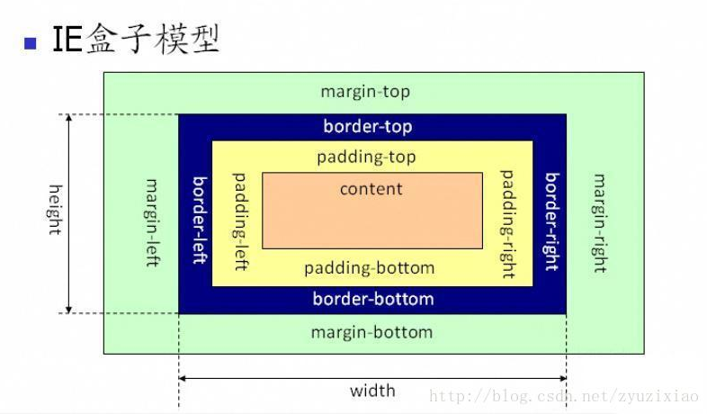

<!DOCTYPE html PUBLIC "-//W3C//DTD XHTML 1.0 Transitional//EN" "http://www.w3.org/TR/xhtml1/DTD/xhtml1-transitional.dtd">
<html xmlns="http://www.w3.org/1999/xhtml">
<head>
<meta http-equiv="Content-Type" content="text/html; charset=utf-8" />
<title>无标题文档</title>
</head>
<!-- 优先级：内联式 > 嵌入式 > 外部式 , 视情况而定，就近原则-->
<!--外部式CSS-->
<link href="../style.css" rel="stylesheet" type="text/css" />

 

<body>
	<h2>Css Introduction</h2>
	<!--内联式CSS-->
	这里是我们成长的乐园，这里是我们快乐的家园，我们在这个家园里健康，快乐成长着。 我们在老师的辛勤培育下，每一颗童稚的心灵，都获得智慧的启迪，为未来开启一扇扇窗，打开一扇扇门。在知识海洋里，像小船一样扬起理想的风帆，为了明天的彼岸乘风破浪。

	<h2>CSS(层叠样式表cascading style sheets):</h2>
	
一种用来表现html/xml等文件样式的计算机语言。 
           样式：文本的字体大小、粗细、颜色、字体、行高；区块的大小、背景色、边框、间距；边框距离文本之间的间距。 
           w3c是CSS的标准。 
           层叠：当我们对同一个元素设置同一个属性的样式时，浏览器会读后面一个的样式。后面的样式会层叠掉前面的样式。
	

	<h2>CSS的盒模型：</h2>
	
html里面所有的元素都可看成是一个盒模型。这个盒模型在网页里占有的区域包含了内容的宽width、高height、内边距padding、边框border、外边距margin。

	
	
w3c模型：包括 margin、border、padding、content，并且 content 部分不包含其他部分

	  
	
	
ie模型：包括 margin、border、padding、content，content 部分包含了 border 和 padding

	

	<h2>网页布局：</h2>
	
就是把网页分成不同的区块。 
           种类：上下、左右、上中下、左中右
	

</body>
</html>
